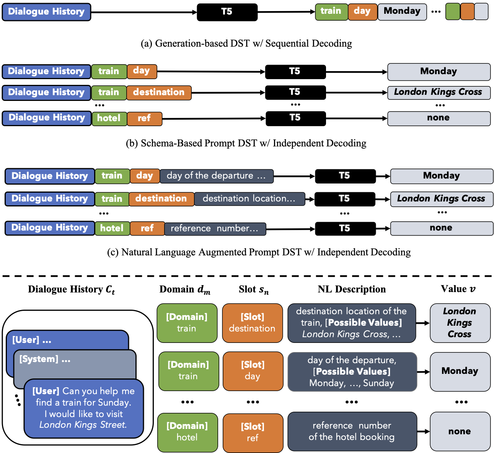

# SDP-DST: (Schema) Prompt-Based Finetuning for Dialogue State Tracking with Language Models

This is the original implementation of "[Dialogue State Tracking with a Language Model using Schema-Driven Prompting](https://aclanthology.org/2021.emnlp-main.404/)" by [Chia-Hsuan Lee](https://chiahsuanlee.github.io/), [Hao Cheng](https://sites.google.com/site/hcheng2site) and [Mari Ostendorf](https://people.ece.uw.edu/ostendorf/).
EMNLP 2021, Long Paper

<p align="center">
  
</p>

The task is to track user intents predefined by a schema (ontology) in a multi-turn conversation with an agent. 
SDP-DST is designed to finetune a sequence-to-sequence language model to produce associated slot values given the input prompts derived from schema.

[**Installation**](#Installation) | [**Preprocess**](#Download-and-Preprocess-Data) | [**Training**](#Training) | [**Evaluation**](#Evaluation) | | [**Citation**](#Citation-and-Contact)

## Installation

Create a conda environment
```console
conda env create -f env.yml
```


## Download and Preprocess Data

To download and create the [MultiWoz 2.4](https://github.com/smartyfh/MultiWOZ2.4/) 
```console
python create_data.py --main_dir mw24_src --mwz_ver 2.4 --target_path mw24
```
for [MultiWOZ 2.1](https://arxiv.org/abs/1907.01669)
```console
python create_data.py --main_dir mw21_src --mwz_ver 2.1 --target_path mw21
```


We provide two types of prompting strategies: 
1) `Prompt by Slot`: described as independent decoding in the paper, this method prompts the LM by a full dialogue histroy + a pair of domain and slot and their associated textual descriptions. The LM then produces the corresponding slot value given this prompt.  

2) `Prompt All Domain`: described as sequential decoding in the paper, this method prompts the LM by a dialogue turn pair and the full schema string. The LM then produces the dialogue state changes for all domains for the current turn. 

`Prompt by Slot` gives better accuracies but is more computationally expensive.

To preprocess for `Prompt by Slot`, 
```console
python preprocess_mw24_prompt_by_slot.py --in_train_fn ./mw24/train_dials.json --in_test_fn ./mw24/test_dials_mw24.json --out_train_fn ./mw24/mw24_prompt_by_slot_train.json --out_test_fn ./mw24/mw24_prompt_by_slot_test.json
```

To preprocess for `Prompt All Domain`, 
```console
python preprocess_mw24_prompt_alldomains.py --in_train_fn ./mw24/train_dials.json --in_test_fn ./mw24/test_dials_mw24.json --out_train_fn ./mw24/mw24_prompt_alldomains_train.json --out_test_fn ./mw24/mw24_prompt_alldomains_test.json
```


To preprocess for `Prompt by Slot` on [MultiWoz 2.2](https://github.com/budzianowski/multiwoz/tree/master/data/MultiWOZ_2.2),
```console
cd data
unzip MultiWOZ_2.2.zip
python preprocess_mw22_prompt_by_slot.py MultiWOZ_2.2
```

## Training

To train for `Prompt by Slot` on MultiWOZ 2.4
```console
python run_t5.py \
   --model_name_or_path t5-base  \
    --do_train \
    --do_predict \
    --train_file mw24_SDPDST_train100p.json \
    --test_file mw24_SDPDST_test100p.json \
    --source_prefix "" \
    --output_dir ./exps/t5base_mw24_prompt_by_slot/ \
    --per_device_train_batch_size=48 \
    --predict_with_generate \
    --text_column="dialogue_schema_prompt" \
    --summary_column="value" \
    --num_train_epochs 3 \
    --max_source_length 512 \
    --max_target_length 10 \
    --save_steps 10000 \
    --learning_rate 5e-4
```
- `--model_name_or_path`: name of the model card, like `t5-small`, `t5-base`, etc
At the end of training, the model will get predictions on `$test_file` and store the results at `$output_dir/generated_predictions.txt` .

To train for `Prompt All Domain` on MultiWOZ 2.4
```console
python run_t5.py \
   --model_name_or_path t5-base  \
    --do_train \
    --do_predict \
    --train_file ./mw24/mw24_prompt_alldomains_train.json \
    --test_file ./mw24/mw24_prompt_alldomains_test.json \
    --source_prefix "" \
    --output_dir ./exps/t5base_mw24_prompt_alldomains/ \
    --per_device_train_batch_size=48 \
    --predict_with_generate \
    --text_column="schema_prev_dst_turn_pair_reversed" \
    --summary_column="tlb" \
    --num_train_epochs 20 \
    --max_source_length 512 \
    --max_target_length 100 \
    --save_steps 5000
```

To train for `Prompt by Slot` on MultiWOZ 2.2
```console
python run_t5.py \
    --model_name_or_path t5-base \
    --do_train \
    --do_predict \
    --train_file ./MultiWOZ_2.2/train.json \
    --test_file ./MultiWOZ_2.2/test.json \
    --source_prefix "" \
    --output_dir ./exps/t5base_mw22_prompt_by_slot/ \
    --per_device_train_batch_size=48 \
    --predict_with_generate \
    --text_column="dialogue" \
    --summary_column="state" \
    --save_steps=500000
```

## Evaluation

For MultiWOZ 2.4 `Prompt by Slot`,
```console
python eval_mw24_prompt_by_slot.py --pred_fn ./exps/MWOZ/t5base_mw24_prompt_by_slot/generated_predictions.txt --gold_fn ./data/mw24_prompt_by_slot_test.json --ontology_fn ./data/ontology_mw24.json
```


For MultiWOZ 2.4 `Prompt All Domain`,
```console
python eval_mw24_prompt_alldomains.py --pred_fn ./exps/t5base_mw24_prompt_alldomains/generated_predictions.txt --gold_fn ./data/mw24_prompt_alldomains_test.json --ontology_fn ./data/ontology_mw24.json
```

For MultiWOZ 2.2 `Prompt by Slot`, we follow the official evaluation script from [Google SGD](https://github.com/google-research/google-research/tree/master/schema_guided_dst), 
```console
cd data
python postprocess_mw22_prompt_by_slot.py --data_dir ./MultiWOZ_2.2 --out_dir ./MultiWOZ_2.2/dummy/ --test_idx ./MultiWOZ_2.2/mw24_prompt_by_slot_test.idx --prediction_txt ../exps/t5base_mw22_prompt_by_slot/generated_predictions.txt

cd ../
python eval_mw22_prompt_by_slot.py --data_dir ./data/MultiWOZ_2.2 --prediction_dir ./data/MultiWOZ_2.2/dummy/ \
    --output_metric_file ./data/MultiWOZ_2.2/dummy/prediction_score
```

## Citation and Contact

If you find our code or paper useful, please cite the paper:
```bib
@inproceedings{lee2021dialogue,
  title={Dialogue State Tracking with a Language Model using Schema-Driven Prompting},
  author={Lee, Chia-Hsuan and Cheng, Hao and Ostendorf, Mari},
  booktitle={Proceedings of the 2021 Conference on Empirical Methods in Natural Language Processing},
  pages={4937--4949},
  year={2021}
}
```

Please contact Chia-Hsuan Lee (chiahsuan.li[at]gmail.com) for questions and suggestions.
